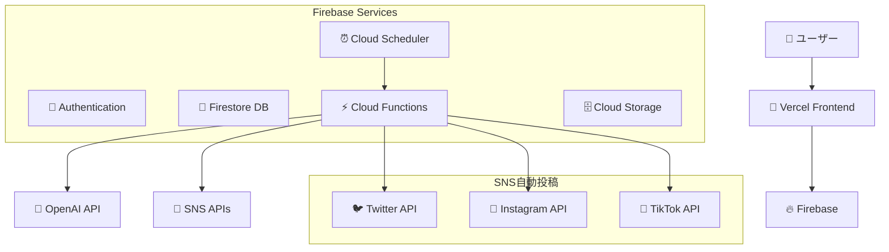
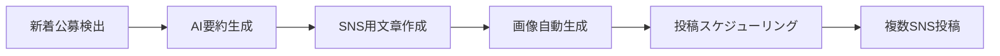

# 🏰 PrologueLab

**エンジニア・学生の挑戦を応援する、公募・支援情報ポータル**

*"始まりの一歩、大冒険への扉" - Your First Step into New Challenges*


## 🎯 プロジェクト概要

PrologueLabは、**無料で参加できる価値ある体験**を中心に、ハッカソン・勉強会・コンテスト・奨学金などの情報を集約するポータルサイトです。[きっかけポータル](https://kikkakeportal.com/)にインスパイアされた、シンプルで実用的なデザインを採用しています。

### 🌟 重点領域
- **ハッカソン**: Spajam、JPHacks、技育プロジェクト等
- **勉強会**: Connpass、TECH PLAY、Doorkeeper
- **コンテスト**: プログラミング、デザイン、研究コンテスト
- **奨学金・助成金**: 研究開発資金、海外留学支援
- **インターンシップ**: 無料で参加できる技術系企業のプログラム

### 🚀 特徴
- **週3回の自動SNS投稿** (Twitter, Instagram, TikTok)
- **AI powered情報分類・要約**
- **エンジニア向けTwitter投稿の監視**
- **予算月1000円以内での運営**

## 🏗️ 技術構成 (確定版)

### 🔥 **Firebase + Vercel 構成**
**選択理由**: Google製で信頼性高、豊富なドキュメント、大きな無料枠、メンテナンス性良好



### Frontend
- **Next.js 14** (App Router) - TypeScript
- **Tailwind CSS + shadcn/ui** - モダンUI
- **Zustand** - 軽量状態管理
- **React Hook Form + Zod** - フォームバリデーション
- **Framer Motion** - アニメーション

### Backend
- **Firebase Firestore** - NoSQLデータベース
- **Firebase Authentication** - ユーザー認証
- **Firebase Cloud Functions** - サーバーレス処理
- **Firebase Cloud Storage** - ファイル保存
- **Firebase Cloud Scheduler** - 定期実行

### データ収集・AI
- **Puppeteer** - Webスクレイピング
- **OpenAI API** (gpt-3.5-turbo) - 情報分類・要約
- **Connpass API** - 勉強会情報取得
- **Twitter API** - エンジニア投稿監視

## 💰 運営コスト (月額1000円以内)

### 無料枠の活用
- **Firebase**: 無料枠で十分 (初期段階)
- **Vercel**: 無料枠 (個人プロジェクト)
- **OpenAI API**: ~¥1,500/月 (使用量次第)

### SNS API戦略
- **Phase 1**: Twitter API無料枠 + 手動投稿
- **Phase 2**: IFTTT/Zapier活用 (~¥500/月)
- **Phase 3**: 収益化後にTwitter API Basic (¥15,000/月)

## 📊 データ収集対象

### 🎯 優先度高
1. **ハッカソン・コンテスト**
   - Spajam (年2回)
   - JPHacks (年1回、学生向け)
   - 技育プロジェクト
   - Open Hack U (Yahoo主催)

2. **勉強会プラットフォーム**
   - Connpass (API利用)
   - TECH PLAY
   - Doorkeeper (API利用)

3. **政府・公的機関**
   - 文科省 (科研費、JST)
   - 経産省 (IPA)
   - 外務省 (国際交流)

### 📱 SNS監視
- **Twitter監視ハッシュタグ**:
  - #エンジニア転職 #ハッカソン #勉強会
  - #プログラミング #技育 #開発

## 🎨 UI/UXデザイン

### デザイン方針
[きっかけポータル](https://kikkakeportal.com/)を参考にした**シンプル実用路線**
- 情報の見つけやすさ重視
- RPG要素は控えめ (アイコン・色程度)
- モバイルファースト
- 検索・フィルタリング充実

### カード型レイアウト
```typescript
interface OpportunityCard {
  title: string;
  summary: string;
  deadline: Date;
  difficulty: 1 | 2 | 3 | 4 | 5; // 星マーク
  category: string; // アイコン付き
  reward?: number; // コイン表示
  tags: string[];
  isFree: boolean; // 無料フラグ
}
```

## 🚀 開発ロードマップ

### Week 1-2: 基盤構築
- [ ] Next.js + Firebase プロジェクト初期化
- [ ] 認証システム実装
- [ ] 基本UI/コンポーネント作成
- [ ] Firestore CRUD操作

### Week 3-4: コア機能
- [ ] 公募情報表示・検索
- [ ] フィルタリング機能
- [ ] ユーザー機能 (ブックマーク等)
- [ ] 管理画面 (手動データ投入)

### Week 5-6: データ収集自動化
- [ ] Cloud Functions でクローラー
- [ ] Connpass API連携
- [ ] OpenAI分類システム
- [ ] Cloud Scheduler設定

### Week 7-8: SNS連携
- [ ] 投稿コンテンツ生成 (AI)
- [ ] 画像自動生成 (Canvas API)
- [ ] IFTTT/Zapier連携
- [ ] 投稿スケジューリング

## 📱 SNS自動投稿システム

### 投稿戦略 (週3回)
- **月曜**: 新着ハッカソン情報
- **水曜**: 勉強会・イベント情報  
- **金曜**: 奨学金・助成金情報

### コンテンツ生成フロー


## 📁 プロジェクト構成

```
prologue-lab/
├── apps/
│   └── web/              # Next.js アプリ
├── libs/
│   ├── firebase/         # Firebase設定・ユーティリティ
│   ├── ui/              # shadcn/ui コンポーネント
│   └── types/           # TypeScript型定義
├── docs/                # 技術文書
├── data/               # サンプルデータ・スキーマ
└── functions/          # Firebase Cloud Functions
```

## 🤝 コントリビューション

### 歓迎する貢献
1. **情報提供**: 新しい公募情報・イベント情報
2. **UI/UX改善**: より使いやすいデザイン提案
3. **データ収集**: 新しい情報源の提案・実装
4. **SNS戦略**: 効果的な投稿方法の提案

### 開発参加方法
1. Issues で機能提案・バグ報告
2. Pull Requests でコード貢献
3. Discussions でアイデア共有

詳細は [CONTRIBUTING.md](CONTRIBUTING.md) を参照

## 📊 成功指標

### Phase 1 (MVP) 目標
- [ ] 月間ユーザー 1,000人
- [ ] 掲載情報数 100件
- [ ] SNSフォロワー 500人

### Phase 2 (成長期) 目標
- [ ] 月間ユーザー 10,000人
- [ ] 掲載情報数 1,000件
- [ ] SNSフォロワー 5,000人

## 📄 ライセンス

MIT License - 詳細は [LICENSE](LICENSE) ファイルを参照

## 📞 お問い合わせ

- **GitHub Issues**: バグ報告・機能要望
- **GitHub Discussions**: 一般的な質問・アイデア共有
- **Twitter**: [@prologue_lab](https://twitter.com/prologue_lab) (予定)

---

## 🔗 参考・インスピレーション

- [きっかけポータル](https://kikkakeportal.com/) - UI/UX参考
- [Connpass](https://connpass.com/) - 勉強会情報API
- [Spajam](https://spajam.jp/) - ハッカソン参考

---

*🌟 あなたの挑戦はここから始まる - PrologueLab で新しい機会を見つけよう！*